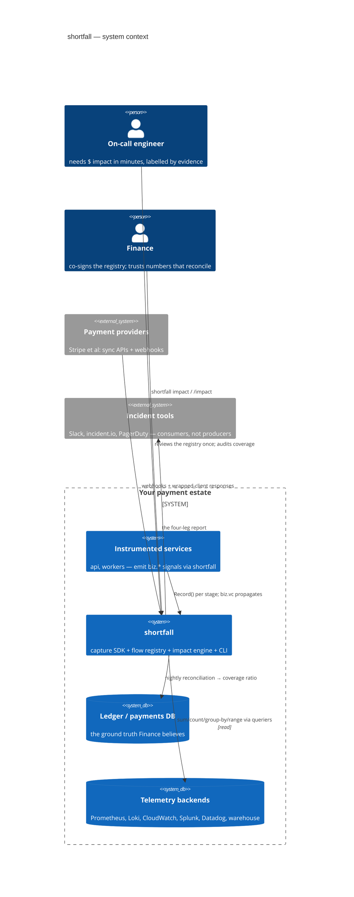

# C4 Level 1 — system context

What an incident cost, who it hit, and how sure you are — where that
answer sits among the people and systems that produce and consume it.

The two questions that shape everything: **Q1 attribution**
(deterministic — which transactions, whose money) rides the outcome
events; **Q2 counterfactual** (statistical — what never happened) rides
baselines over the metrics. shortfall's job is to answer both and label
which is which.
