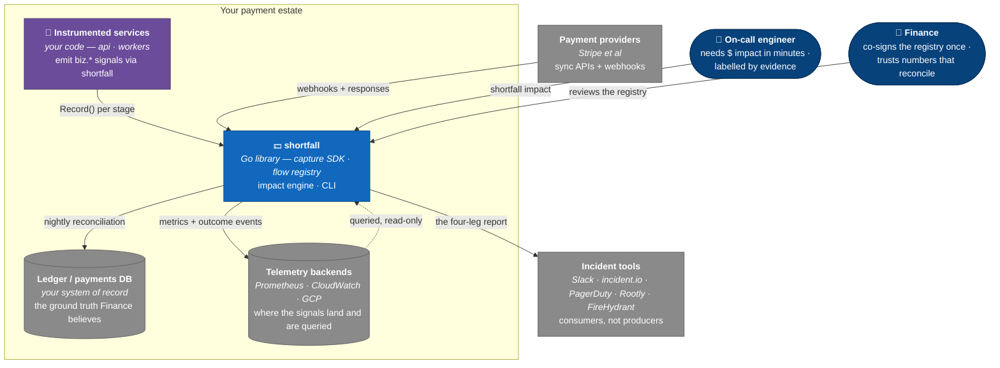

# C4 Level 1 — system context

Where the answer sits among the people and systems that produce and
consume it. shortfall is a single box here on purpose — the whole system
in scope, CLI included. The module boundaries inside it come at
[Level 2](c4-l2-containers.md).

| Edge | Protocol / notes |
|---|---|
| Instrumented services → shortfall | In-process Go call — `Record()` at each stage transition; `biz.vc` propagates the `ValueContext` across process hops (HTTP Baggage, queue headers) |
| shortfall → telemetry backends | Bounded metrics on the fixed ADR-0004 label families, plus **unsampled** outcome events; written through the `emit.Exporter` interface an export adapter implements |
| Telemetry backends → shortfall | Read-only, through the `query.Querier` interface — only four verbs: sum · count · group-by · range, plus event order. Nothing else is askable |
| Payment providers → shortfall | Provider webhooks and wrapped-client responses become `biz.Outcome`s; a delivery hours late still lands on the right window |
| shortfall → ledger / payments DB | Nightly reconciliation — telemetry Σ at the value stage vs the ledger, yielding the **coverage ratio** (ADR-0011, anchored to one declared value stage by ADR-0016) — never a correction to either side |
| shortfall → incident tools | The four-leg report, posted and refreshed; these tools consume the number and never produce one |
| On-call → shortfall | `shortfall impact` on the CLI (`cmd/shortfall`), against the window the incident spans |
| Finance → shortfall | Reviews and co-signs the YAML flow registry once; thereafter audits the coverage ratio rather than the code |

## What this diagram encodes

- **Two questions, and shortfall labels which is which.** *Attribution*
  (deterministic — which transactions, whose money) rides the outcome
  events. *Counterfactual* (statistical — what never happened) rides
  baselines over the metrics. Answering both is the job; saying which one
  a number is, is the discipline.
- **The ledger is a check, not an input.** Reconciliation compares
  telemetry against the ledger and reports the ratio. shortfall does not
  reconcile *into* the ledger and never adjusts telemetry to match it — a
  disagreement is a finding, not something to smooth over.
- **shortfall never sees a backend.** The only two doors are
  `emit.Exporter` going out and `query.Querier` coming back; adapters own
  everything past them. Swapping Prometheus for CloudWatch is an import
  change, not an engine change.
