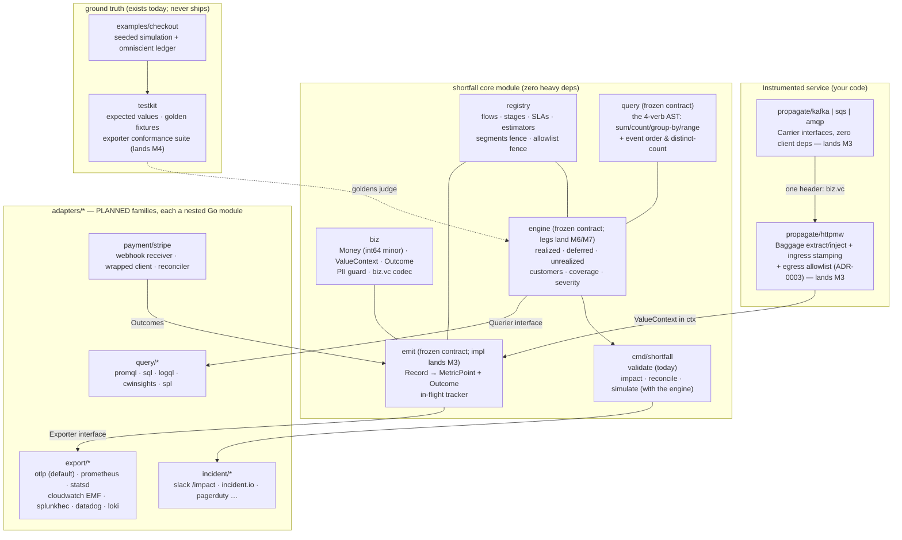

# C4 Level 2 — containers

Four layers; only the top one knows your vendors. The core emits two
normalized signals and never touches a backend; adapters translate on the
way out and back in.

**Reading this diagram honestly:** solid boxes in `core` exist today
(the v0.1.0 frozen surface — `emit`, `query`, `engine` are frozen
contracts whose implementations land in M3/M6). Everything in
`adapters/*` is a **planned family** (see `adapters/README.md`) landing
per milestone, and the CLI serves `validate` today with the other verbs
arriving with the engine.

Boundary rules the gate enforces mechanically:

- `engine` imports only `query`, `registry`, `biz`, and its own
  subpackages (`engine-import-boundary` rule — an allowlist, not a
  blocklist).
- Amounts and ids ride events only; metrics carry the fixed ADR-0004
  label families.
- A Prometheus user never pulls stripe-go: every adapter is its own
  nested module.
