# C4 Level 2 — containers

Zoom inside the shortfall box from [Level 1](c4-l1-context.md): the Go
modules and the packages within them. Four bands; only the opt-in band knows
your vendors. The core emits two normalized signals and never touches a
backend; adapters translate on the way out and back in.

Colour is the **module boundary** ([the stencil](STYLE.md)): violet is your
code, dark blue is the one module you import, mid blue is a nested module you
opt into separately, ochre-dashed never ships. Arrow labels are short — the
interfaces and the constraints are in the table below.

```mermaid
flowchart TB
    subgraph app["Your service — one process"]
        direction TB
        CODE["🧩 <b>your handlers · workers</b><br/><i>your code</i><br/>call Record() at each stage transition"]
        MW["<b>propagate/httpmw</b><br/><i>net/http middleware</i><br/>Baggage extract / inject ·<br/>ingress stamping · egress allowlist"]
        CARRIERS["<b>propagate/kafka · sqs · amqp</b><br/><i>carrier interfaces, zero client deps</i><br/>one header — biz.vc — across the queue hop"]
    end

    subgraph core["shortfall core module — zero heavy deps"]
        direction TB
        BIZ["<b>biz</b><br/><i>value types</i><br/>Money (int64 minor) · ValueContext ·<br/>Outcome · PII guard · biz.vc codec"]
        REG["<b>registry</b><br/><i>YAML, co-signed once</i><br/>flows · stages · SLAs · estimators ·<br/>segments fence · allowlist fence"]
        EMIT["<b>emit</b><br/><i>the capture path</i><br/>Record → MetricPoint + Outcome ·<br/>in-flight tracker · loud drops"]
        QUERY["<b>query</b><br/><i>the 4-verb AST</i><br/>sum · count · group-by · range +<br/>event order — nothing else is askable"]
        ENGINE["<b>engine</b><br/><i>the report</i><br/>realized · deferred · unrealized ·<br/>customers · coverage · severity"]
    end

    subgraph optin["Separate nested Go modules — opt in one at a time"]
        direction TB
        CLI["⌨️ <b>cmd/shortfall</b><br/><i>its own module — pulls a SQLite driver</i><br/>validate · impact · reconcile"]
        EXP["<b>adapters/export/*</b><br/><i>otlp · prometheus · cloudwatch EMF · gcp</i><br/>emit.Exporter implementations"]
        QAD["<b>adapters/query/*</b><br/><i>promql · cwinsights · gcplogging · sql</i><br/>query.Querier implementations"]
        PAY["<b>adapters/payment/stripe</b><br/><i>stripe-go</i><br/>webhook receiver ·<br/>wrapped client · reconciler"]
        INC["<b>adapters/incident/*</b><br/><i>slack · incidentio · pagerduty ·<br/>rootly · firehydrant</i><br/>post + refresh the impact ledger"]
    end

    subgraph verify["Ground truth — never ships"]
        direction TB
        HARNESS["🧪 <b>examples/checkout</b><br/><i>synthetic payment system</i><br/>seeded simulation + omniscient ledger"]
        TESTKIT["<b>testkit</b><br/><i>scenario runner</i><br/>expected values · golden fixtures ·<br/>exporter conformance suite"]
    end

    CODE -->|"Record()"| EMIT
    MW -->|"ValueContext in ctx"| EMIT
    CARRIERS -->|"biz.vc off the message → ctx"| EMIT
    BIZ --- EMIT
    REG --- EMIT
    EMIT -->|"Exporter interface"| EXP
    ENGINE -->|"Querier interface"| QAD
    REG --- ENGINE
    QUERY --- ENGINE
    PAY -->|"Outcomes"| EMIT
    ENGINE -->|"Compute()"| CLI
    ENGINE -->|"engine.Report"| INC
    HARNESS --> TESTKIT
    TESTKIT -.->|"goldens judge"| ENGINE

    classDef yours   fill:#6b4c9a,stroke:#4a3369,color:#fff;
    classDef core    fill:#1168bd,stroke:#0b4884,color:#fff;
    classDef optin   fill:#2e6fb0,stroke:#0b4884,color:#fff;
    classDef harness fill:#8a6d1f,stroke:#5c4814,color:#fff,stroke-dasharray:6 4;
    class CODE yours;
    class MW,CARRIERS,BIZ,REG,EMIT,QUERY,ENGINE core;
    class CLI,EXP,QAD,PAY,INC optin;
    class HARNESS,TESTKIT harness;
```

| Edge | Protocol / notes |
|---|---|
| your code → `emit` | In-process Go call — `Record()` per stage transition; the `ValueContext` comes off the `ctx` the middleware stamped |
| `propagate/httpmw` → `emit` | The decoded `ValueContext` rides in `context.Context`; ingress stamps it, egress injects it only toward registry-allowlisted hosts (ADR-0003, deny by default) |
| queue carriers → `emit` | A sibling seam to the HTTP middleware, not a stage before it: your consumer calls `propagate.Extract` to read the single `biz.vc` header (ADR-0003) off the message and puts the `ValueContext` on its `ctx`, where `Record()` finds it. The carrier interfaces take no Kafka/SQS/AMQP client dependency, so your client stays yours |
| `biz` / `registry` → `emit` | Compile-time dependency, not a call: `emit` gets its money type and PII guard from `biz`, and its legal flows, stages and segment enum from `registry` |
| `emit` → export adapter | The `emit.Exporter` interface — bounded metrics on the ADR-0004 label families plus **unsampled** outcome events. A drop increments `biz_dropped_events_total{reason}`; it is never silent |
| `engine` → query adapter | The `query.Querier` interface — the only questions the engine may ask a backend. An adapter that serves no events answers with a `NotAvailableReason`, never zeros |
| `registry` / `query` → `engine` | Compile-time dependency. The `engine-import-boundary` rule enforces the allowlist mechanically: `engine` may import only `query`, `registry`, `biz`, and its own subpackages |
| `adapters/payment/stripe` → `emit` | Provider webhooks and wrapped-client responses become `biz.Outcome`s and enter the same capture path your own code uses |
| `engine` → `cmd/shortfall` | The CLI calls `engine.Compute` and renders the report to stdout via `engine/report` — text, JSON or markdown. Its working verbs are `validate`, `impact` and `reconcile` (plus `version`), and it depends on no incident adapter |
| `engine` → incident adapter | Separately: an incident adapter takes an `engine.Report` value directly (`slack.Client.Post` / `.Refresh`) and posts and refreshes it. Your program wires that call — it is not a CLI hand-off |
| `examples/checkout` → `testkit` → `engine` | The harness knows the true answer by construction; `testkit` turns it into golden fixtures that judge the engine. Test-only — no production import path reaches either |

## Key facts this diagram encodes

- **A Prometheus user never compiles stripe-go.** Every box in the opt-in
  band is its own nested Go module with its own `go.mod`. That is the
  architecture's central promise, and it is why the band is a different
  colour from the core: importing shortfall costs you `otel` and
  `yaml.v3`, and nothing else until you ask for more.
- **The CLI is not the core.** `cmd/shortfall` is its own module, and it
  pulls a SQLite driver. Drawing it inside the core box would quietly
  contradict the "zero heavy deps" claim the core box makes — so it sits in
  the opt-in band with the adapters.
- **Two interfaces are the whole vendor surface.** `emit.Exporter` going
  out, `query.Querier` coming back. Neither `emit` nor `engine` has ever
  seen a backend, and swapping one is an import change.
- **The engine's imports are an allowlist, enforced.** `engine` may reach
  `query`, `registry`, `biz`, and its own subpackages — nothing else. The
  `engine-import-boundary` rule fails the gate on a new import, so the
  boundary is a check rather than a convention.
- **Provider events land in the same funnel as your own.** Stripe webhooks
  do not get a private path into the engine; they become `biz.Outcome`s and
  go through `emit` like everything else, so de-dup, the PII guard and the
  label fences apply to them identically.
- **The CLI is not the only consumer, and not a router.** `cmd/shortfall`
  renders the report to stdout. An incident adapter takes an
  `engine.Report` value from your own program — nothing in the CLI module
  reaches an incident adapter, and its `go.mod` requires none.
- **Amounts and ids ride events only.** Metrics carry the fixed ADR-0004
  label families, so no customer or entity id can turn into an unbounded
  metric label.
- **The ground-truth band never ships.** `examples/checkout` and `testkit`
  exist so the engine can be judged against an answer known by
  construction. The dashed stroke is the reminder: nothing in your build
  should ever reach these.
