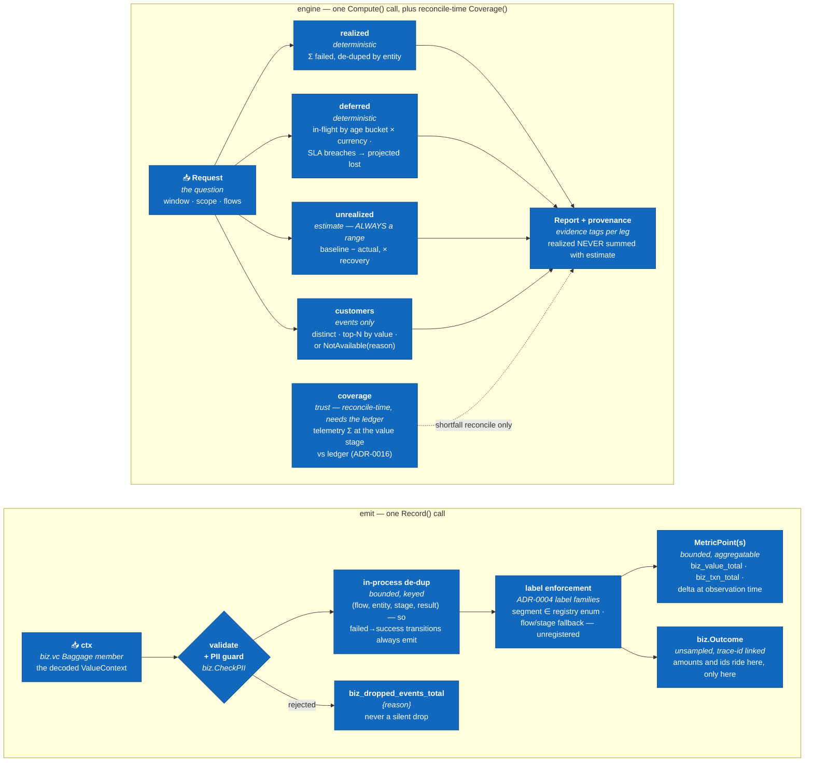

# C4 Level 3 — capture and engine components

Zoom inside two boxes from [Level 2](c4-l2-containers.md): the paths money
takes through the code. What one `Record()` call does on the way in, and how
one `Compute()` call assembles the report on the way out — plus the one leg
`Compute()` cannot answer, and says so instead.

Every box here is `core` blue — this is one module's insides, so the
[stencil](STYLE.md)'s ownership ladder has nothing to separate. Shape does
the work instead: rectangles are components, the diamond is the validation
gate, and the two `Record()` outputs are drawn as the distinct signals they
are. A leg the backend cannot ground is marked unavailable on its own leg —
a caveat on the money legs, a `NotAvailableReason` on customers, a note on
the counterfactual and coverage legs — never a fabricated zero.

| Edge | Protocol / notes |
|---|---|
| `ctx` → validate | The `ValueContext` was decoded from the single `biz.vc` Baggage member (ADR-0003); `Record()` reads it off `context.Context` rather than taking it as an argument |
| validate → de-dup | Passes only if the amount, flow, stage and segment are legal **and** `biz.CheckPII` finds no email / PAN / IBAN in the attributes |
| validate → `biz_dropped_events_total` | Every rejection increments the counter with a `{reason}` label. There is no path out of `Record()` that discards an event without saying so |
| de-dup → label enforcement | The in-process key is (flow, entity, stage, result) — **result is in the key**, which is why a `failed → success` transition on the same entity still emits |
| label enforcement → MetricPoints | Bounded by construction: segment must be in the registry's enum, and an unregistered flow or stage falls back to a literal `unregistered` rather than minting a new label value |
| label enforcement → `biz.Outcome` | One outcome event per stage transition, linked by trace id and emitted **regardless of trace sampling** — money accounting never depends on a sampler. Amounts and entity/customer ids ride the event, never a metric label |
| `Request` → the four legs | One `Compute()` fans out to realized, deferred, unrealized and customers; each answers independently and each carries its own evidence tag (`deterministic` / `estimate`). A leg whose query fails is marked unavailable on itself rather than failing the report |
| `coverage` ⇢ `Report` | **Dotted, because `Compute()` does not compute it.** `engine.Coverage` needs a provider ledger an impact `Request` does not carry, so `Compute()` fills the leg with an explicit unavailable reason ("run shortfall reconcile for the trust number") rather than a fabricated 100%. The real number comes from `shortfall reconcile` |
| the legs → `Report` | Assembly, not arithmetic across legs. The `Report` is the four legs plus the coverage trust line, a severity suggestion (ADR-0013), and the provenance (`GeneratedAt`, `RegistryVersion`, `LibraryVersion`) a postmortem needs — never a single blended number |

## Key facts this diagram encodes

- **There is no silent drop.** The only exit from validation other than the
  happy path is `biz_dropped_events_total{reason}`. An exporter or a guard
  that swallowed an outcome without incrementing a visible counter would be
  a defect, not a degradation.
- **De-dup keys on the result, deliberately.** Bounding the in-process
  de-dup by (flow, entity, stage, result) is what lets a transaction that
  failed and then succeeded emit both — a key without `result` would eat
  the recovery and silently overstate loss.
- **The two outputs are different kinds of thing.** MetricPoints are
  bounded and aggregatable; outcome events are unsampled and carry the
  money and the ids. Q2 (counterfactual) rides the metrics, Q1
  (attribution) rides the events, and cardinality protection is exactly the
  rule that keeps them from converging.
- **Every event-summing leg de-duplicates across processes.** Replicas can
  each emit the same outcome — the in-process de-dup cannot see across
  processes — so realized **and** coverage de-duplicate by entity,
  successes included.
- **An unanswerable leg says so on its own leg.** A querier without events
  yields a `NotAvailableReason`, never zeros; `EstLeg` has no
  single-number form at all, only Low/Mid/High per currency. The frozen
  types make the honest shape the only expressible one.
- **Deadline-breach money belongs to `deferred`.** Its projected-lost
  figure is an SLA projection, not a realized loss, and moving it into
  `realized` would turn an estimate into a fact.
- **Realized is never summed with an estimate.** The report assembles the
  four legs plus the coverage trust line and keeps their evidence tags; it
  does not add them into one headline number, because they are not the same
  kind of claim.
- **An impact report never carries a real coverage number.** Coverage needs
  the provider ledger, which an impact `Request` does not carry, so
  `Compute()` writes an unavailable reason and points at `shortfall
  reconcile`. Rendering that absence as 100% would invert the meaning of
  the one line whose job is to say how much you can trust the rest.
