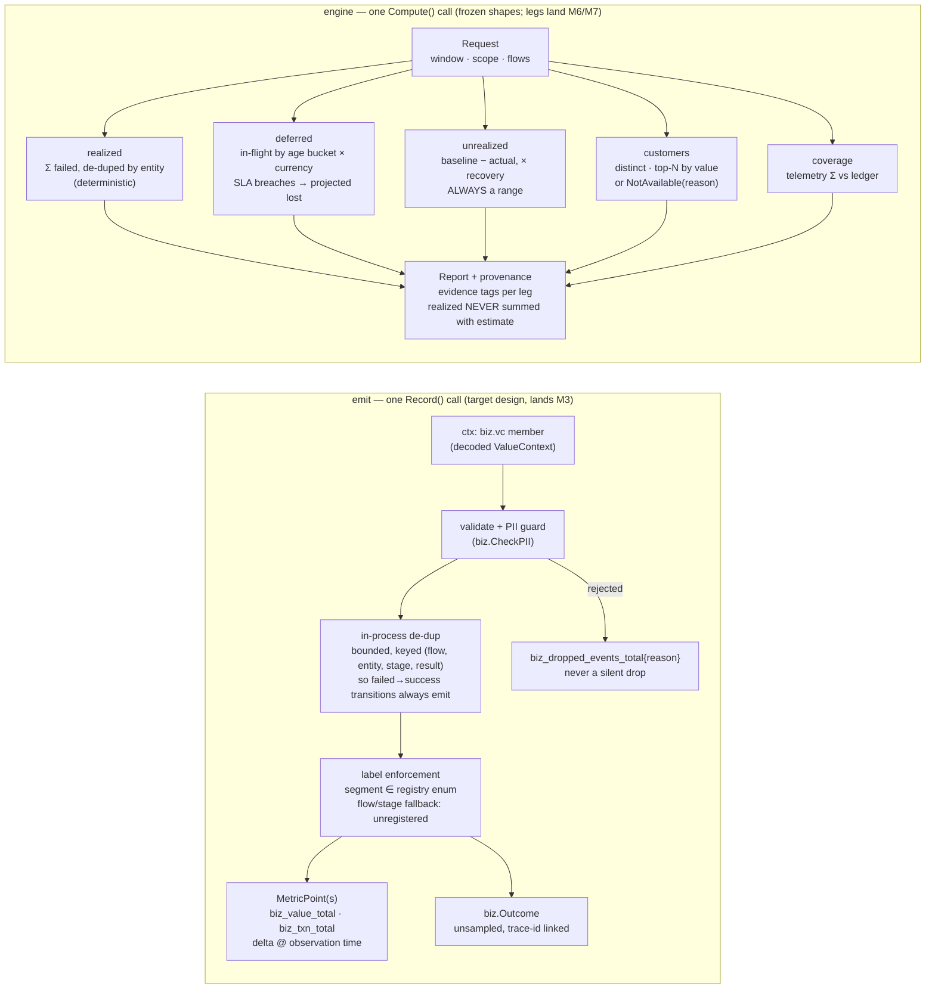

# C4 Level 3 — capture and engine components

The paths money takes through the code. **This is the TARGET design**:
the shapes are the v0.1.0 frozen contracts, the internals are the plan of
record for the emitter (M3) and engine legs (M6/M7) — the code refuses
loudly (`engine.ErrNotImplemented`) until each lands.

Cross-process rule the engine legs implement: replicas can each emit the
same outcome (the in-process de-dup cannot see across processes), so every
event-summing leg — realized AND coverage — de-duplicates by entity,
successes included.

Evidence discipline, enforced by the frozen types: `Leg.Evidence` is
deterministic/estimate/trust; `EstLeg` has no single-number form — only
Low/Mid/High per currency; a querier without events yields
`NotAvailableReason`, never zeros. Deadline-breach money belongs to the
DEFERRED leg's projected-lost, never to realized.
