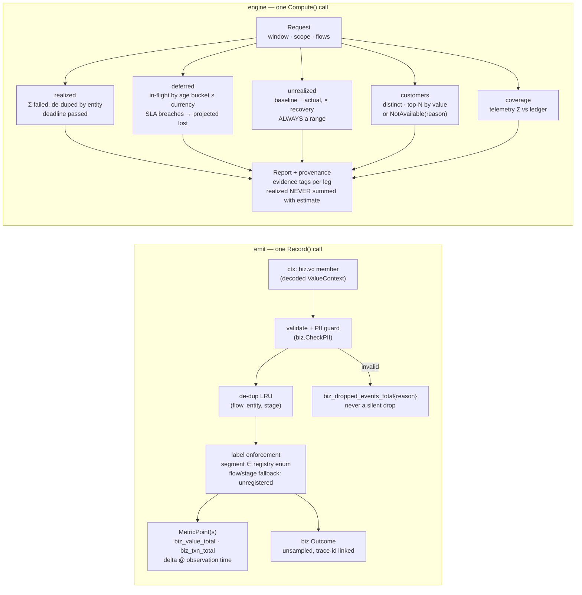

# C4 Level 3 — capture and engine components

The paths money takes through the code. Left: one stage transition
becoming signals. Right: one question becoming a report.

Evidence discipline, enforced by types: `Leg.Evidence` is
deterministic/estimate/trust; `EstLeg` has no single-number form — only
Low/Mid/High per currency; a querier without events yields
`NotAvailableReason`, never zeros.
