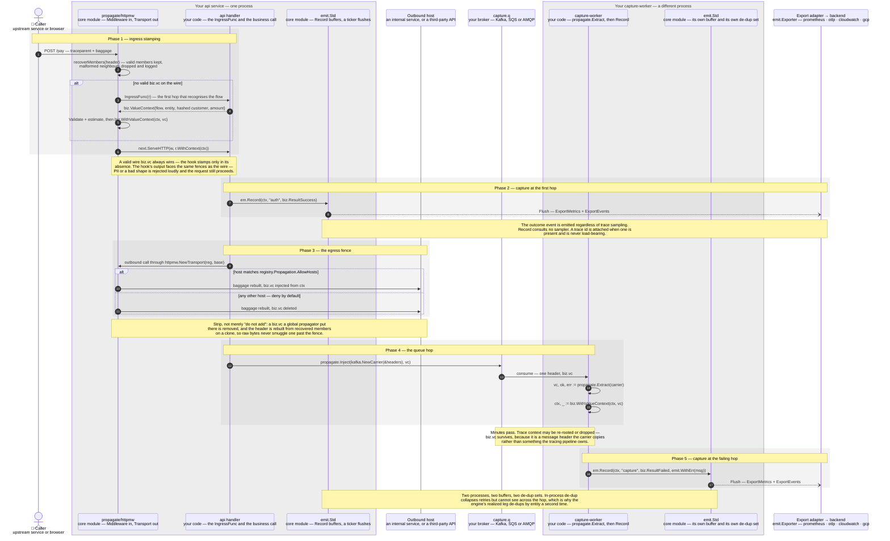
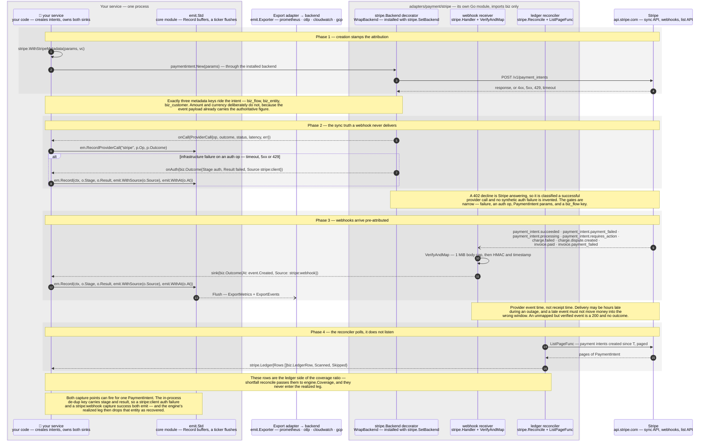
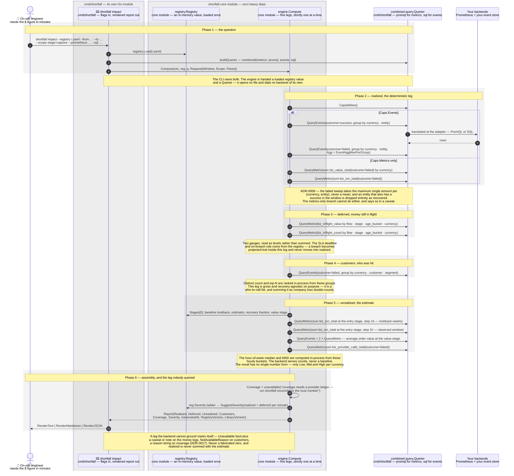

# The money path

Three sequences, one path. A value context is stamped and propagated
(§1), provider events join the same funnel (§2), and a question becomes
a four-leg report (§3). The structural view is at
[C4 L1–L3](README.md); this page is the dynamic one.

---

## 1. Record and propagate across a queue

The direct fix for "correlation_id sometimes isn't there": the value
context is a first-class propagated thing — **one** Baggage member,
re-attached by the consumer with one header copy and no per-team
instrumentation ask.

Five phases, two of which are fences rather than steps: the **ingress
stamp**, where a request that arrived without a value context gets one,
and the **egress fence**, where a request heading somewhere it should not
carry money loses it again.

| # | Step | Mechanism / constraint |
|---|---|---|
| 2 | `httpmw` → itself | `recoverMembers` parses the `baggage` header member by member and keeps the valid ones on the `context.Context`. A malformed neighbour is dropped and logged, never fatal, and never hides a valid `biz.vc`. **The decode to a `ValueContext` is lazy** — it happens in `biz.FromContext`, at read time |
| 3 | `httpmw` → api handler | `IngressFunc func(*http.Request) (biz.ValueContext, bool)` is your code, because only your code knows which route is which flow. Called **only** when the wire carried no valid `biz.vc` |
| 4 | api handler → `httpmw` | A hook that cannot know the amount returns `Estimated: true` with a zero amount, and the registry's estimator fills it |
| 5 | `httpmw` → itself | `vc.Validate()` first — the PII guard lives here, **not** in the codec — then `biz.WithValueContext`. Encode fails loudly past **512 UTF-8 bytes** (`*biz.OversizeError`); either way the request proceeds without a stamp rather than 500ing |
| 7 | api handler → `emit` | `Record` reads the `ValueContext` off the `ctx`, never as an argument. It buffers and returns; it never blocks and never returns an error. Two metric points normally (`biz_txn_total` always, `biz_value_total` unless `vc.Estimated`) plus one `biz.Outcome` |
| 8 | `emit` ⇢ export adapter | **Asynchronous.** A background ticker (1 s by default) and `Close` call `Flush`. A drop at any point increments `biz_dropped_events_total{reason}`; the reasons are `invalid`, `overflow` and `export` |
| 9 | api handler → `httpmw` | `NewTransport` is an `http.RoundTripper`, so the fence applies to every outbound call, **including each redirect hop** — a redirect from an allowed host to a disallowed one is fenced at the second hop |
| 10–11 | `httpmw` → outbound host | The allowlist is matched exactly or as `*.domain` against a strictly deeper subdomain; an empty allowlist denies everything. Denied: `delete(members, biz.MemberKey)`. Foreign members still pass through, and if a safe header cannot be rebuilt the `baggage` header is dropped entirely — fail closed |
| 12–13 | api handler → broker → worker | `propagate.Inject` writes exactly one header, key `biz.vc`, the same key the HTTP `baggage` header uses. The encoded form is versioned — a leading `1` and eleven pipe-delimited fields — so a decoder can evolve without breaking an old producer |
| 14 | worker → itself | `propagate.Extract` returns **three** distinguishable outcomes: present and well-formed, absent, and present-but-corrupt. Corrupt is never silently read as absent. The library counts none of them — the error is handed back for your consumer to count |
| 16 | worker → `emit` | The in-process de-dup key is `(flow, entity, stage, result)`. **Result is in the key**, so a later `failed → success` transition on the same entity still emits |

Two things this sequence is drawn to make unmissable. **The egress fence
strips rather than declining to add** — including a member a globally
installed OTel Baggage propagator added — because shipping a transaction
amount and a customer id to a third party is a decision someone makes on
purpose (ADR-0003). And **one member, not eight**: the whole
`ValueContext` is a single versioned `biz.vc`, which is what makes "the
carrier copies one header" true across Kafka, SQS and AMQP alike.

---

## 2. Provider events become outcomes

Same signals, a different capture point. Metadata stamped at creation
makes every webhook arrive pre-attributed, and the wrapped backend sees
the infrastructure failures webhooks never report.

`adapters/payment/stripe` imports **`biz` only** — not `emit`, not
`engine`, not `registry`. It never calls `Record` and never holds an
`Exporter`. It produces `biz.Outcome` values and hands them to callbacks
**your** code registers; your code is what calls `emit`. That seam is why
a non-Stripe user never compiles stripe-go.

| # | Step | Mechanism / constraint |
|---|---|---|
| 1 | your service → itself | `WithStripeMetadata(p MetadataSetter, vc biz.ValueContext)` is a void mutator, not a wrapper. It takes anything with `AddMetadata(key, value string)`, so `*stripe.Params` and every params type embedding it qualifies |
| 2 | your service → backend decorator | Your call site is **unchanged stripe-go**. `WrapBackend` returns a `stripe.Backend` that embeds the inner one and overrides `Call`; install it once with `stripe.SetBackend`. It creates nothing, reads no response body, and is invisible at the call site |
| 4 | Stripe → backend decorator | `providerOutcome` classifies status 0 (transport error or timeout), any 5xx, and 429 as `failed`. **Every other 4xx is `success`** — Stripe answered, and a declined card is a business result, not an outage |
| 5 | backend decorator → your service | `WithProviderMetric` is a callback, not a counter: the adapter observes, `emit` counts. One line wires it, and the call lands on `biz_provider_calls_total{provider, op, outcome}` inside the buffer, the label fence and the drop counter |
| 6 | backend decorator → your service | `WithAuthOutcome`, behind four gates: the call failed, the op is `payment_intents.create` or `.confirm`, the params are `*stripe.PaymentIntentParams`, and `biz_flow` metadata is present. The `ValueContext` is rebuilt from the **request params**, not the response, and `At` is the call-start time |
| 8 | Stripe → webhook receiver | Eight mapped event types, and the mapping is the adapter's whole opinion: succeeded/payment_failed/processing → `capture`, requires_action → `auth` deferred, `charge.failed` → `capture` failed, dispute → `dispute` failed, the two `invoice.*` → `settle`. A verified event outside the map is ignored with a 200 |
| 9 | webhook receiver → itself | Body capped at 1 MiB **before** verification, then `ConstructEventWithOptions` with `IgnoreAPIVersionMismatch`. The HMAC and timestamp checks still run — only the SDK's `api_version` pin is skipped. A read or signature failure is a 400, which is what makes Stripe retry |
| 10 | webhook receiver → your service | The outcome's `At` is `event.Created` and its `Source` is `stripe:webhook`. There is **no idempotency on `event.ID`** here — redelivery is handled downstream, by entity |
| 13–14 | reconciler → Stripe | `Reconcile(ctx, fetch PageFunc, since)` pages through a caller-supplied `PageFunc`; the loop terminates on `!HasMore`, an empty page, or a cursor that stops advancing. Terminal statuses only are classified, and the amount basis is the intent's `amount` — never `amount_received` (ADR-0010) — so a partial capture does not silently reduce the ledger side |

Two capture points, two sources, and the double-count is caught
downstream: a create that times out emits `auth`/`failed` with
`Source: stripe:client`; if Stripe processed it anyway, the webhook later
emits `capture`/`success`. Both emit, and the realized leg then finds a
success for that entity and drops it. Net realized loss: zero, which is
correct. On a metrics-only backend there is no entity to de-duplicate by,
which is exactly what that leg's `upper bound` caveat admits to.

A Stripe outage does **not** show up here as webhook silence. It shows up
in your own entry-stage counter, which the counterfactual leg compares
against its baseline. What this adapter contributes is positive evidence:
a non-zero `biz_provider_calls_total{outcome="failed"}` in the window
makes the engine append an upstream-attribution hint.

---

## 3. An impact question becomes a four-leg report

Query-time, not ingest-time. The engine asks any backend only four verbs
— sum, count, group-by and time range — plus event order, so nothing
vendor-specific leaks past the adapter.

Two things the picture is drawn to make unmissable: **the legs run one at
a time and degrade one at a time**, and **coverage is never queried here
at all**.

| # | Step | Mechanism / constraint |
|---|---|---|
| 1 | on-call → CLI | `--registry`, `--from` and `--to` are required (RFC3339); `--scope k=v` and `--flow` repeat. With neither `--prometheus` nor `--sql` the command exits 2 before reaching the engine — there is no default backend |
| 3 | CLI → querier | With both flags the CLI builds a `combined` `Querier` over the two nested modules. `Capabilities()` takes **each field from the backend that owns it** — not an intersection: PromQL reports `Events: false` and SQL reports `Metrics: false`, so ANDing them would leave every leg ungrounded |
| 5 | engine → querier | `Capabilities()` is asked **before every leg**. A leg whose capability is absent is skipped and marked, so the unsupported verb is never issued |
| 6 | engine → querier | The recovery sweep: successes in the window, grouped `(currency, entity)`. It reads no money — it exists only to build the set of entities to exclude |
| 7 | querier → backend | The adapter translates. **Every query in this diagram takes this hop**; it is drawn once because the constraint is the same each time |
| 9 | engine → querier | The failure sweep, grouped `(currency, entity)` with `Agg: EventAggMaxPerGroup` — the largest single failed attempt, a real observed figure (ADR-0009) |
| 11 | engine → querier | The metrics-only fallback for `Leg.Count` carries the caveat `metrics-only: upper bound, not de-duped by entity` — metrics have no entity label, by design (ADR-0004) |
| 12–13 | engine → querier | `biz_inflight_value` and `biz_inflight_count`, no aggregation set: gauges read at the window, not summed over it. A missing count gauge beside a non-empty value gauge raises the ADR-0012 caveat rather than inventing a count |
| 14 | engine → querier | Failed events grouped `(currency, customer, segment)` — **no order-by, no limit, no distinct-count verb**. `EventAggDistinctCount` and `OrderSumDesc` exist in the AST and in the adapters, and the engine uses neither |
| 18 | engine → querier | Average order value at the flow's declared value stage (ADR-0016), in a fixed order of preference: successful events, then `biz_value_total ÷ biz_txn_total`, then the registry's estimator. A failed events query is disclosed as a note rather than silently downgraded |
| 20 | engine → itself | **No query.** The trust number needs a provider ledger an impact request does not carry, so `Compute` writes an unavailable reason and `shortfall reconcile` calls `engine.Coverage` separately |
| 21 | engine → registry | `SuggestSeverity` walks the registry's ladder against realized-plus-deferred per minute, **per currency** with no cross-currency sum, taking the most severe level any one currency triggers (ADR-0013). Nothing clearing the lowest threshold returns `""`, never a fabricated severity |
| 23 | CLI → on-call | `--format text` (default), `markdown` or `json`. The three money legs always carry their evidence tag, grounded or not; coverage carries its `[trust]` tag **only when grounded**, which in an impact report it never is. An ungrounded money leg prints `none` with its caveat beside it |

**Realized de-duplicates by entity and excludes recovery.** A transaction
that failed and then succeeded contributes nothing; an entity redelivered
five times contributes its largest single failed attempt once. The
exclusion is set membership over the window, not a timestamp comparison —
a success anywhere in the window clears the entity.

**An impact report never carries a real coverage number.** Rendering that
absence as 100% would invert the meaning of the one line whose job is to
say how much you can trust the rest.
