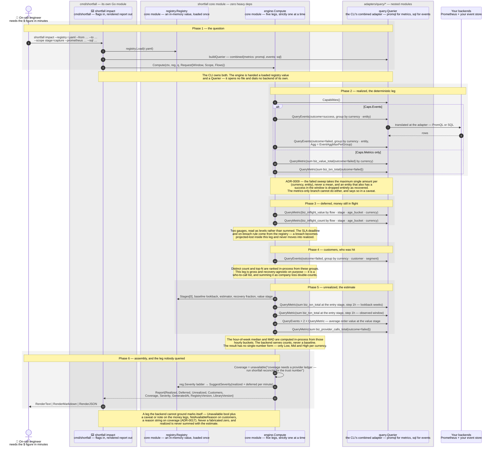

# Sequence — an impact question becomes a four-leg report

Query-time, not ingest-time: the engine asks any backend only the four verbs
— sum, count, group-by and time range over metrics, filter/group-by/order/
distinct-count over events — so nothing vendor-specific leaks past the
adapter. Drawn to [the stencil](STYLE.md); a sequence keeps the label grammar
and the tables and skips the palette
([§5](STYLE.md#5--sequences-the-same-grammar-a-different-renderer)).

Six phases, one per leg plus the question and the assembly. Two things the
picture is drawn to make unmissable: **the legs run one at a time and degrade
one at a time**, and **coverage is never queried here at all**.

| # | Step | Mechanism / constraint |
|---|---|---|
| 1 | on-call → CLI | `--registry`, `--from` and `--to` are required (RFC3339); `--scope k=v` and `--flow` repeat. With neither `--prometheus` nor `--sql` the command exits 2 before reaching the engine — there is no default backend |
| 2 | CLI → registry | `registry.Load` parses and validates the co-signed YAML once. The result is an in-memory `*registry.Registry` value, passed by pointer from here on |
| 3 | CLI → querier | With both backends the CLI builds its own `combined` `Querier`: `QueryMetric` routes to PromQL, `QueryEvents` to SQL, and `Capabilities()` is the **AND** of the two. That routing is why the realized leg's `alt` resolves the way it does |
| 4 | CLI → engine | `Compute(ctx, reg, q, Request{Window, Scope, Flows})`. Everything the engine needs is an argument — no globals, no I/O of its own |
| 5 | engine → querier | `Capabilities()` is asked **before every leg**, and it is the third method on the interface alongside `QueryMetric` and `QueryEvents`. A leg whose capability is absent is skipped and marked, so the unsupported verb is never issued |
| 6 | engine → querier | The recovery sweep: successes in the window, grouped `(currency, entity)`, default aggregation. It reads no money — it exists only to build the set of entities to exclude |
| 7 | querier → backend | The adapter translates. **Every query in this diagram takes this hop**; it is drawn once because the constraint is the same each time — the engine has never seen a backend, only `query.Querier` |
| 8 | backend → querier | `Series` or `EventGroups`. A backend that cannot serve a verb returns `query.ErrUnsupported` — an adapter-side guarantee for direct callers. The engine does not branch on it, because `Capabilities()` already kept it from asking |
| 9 | engine → querier | The failure sweep, grouped `(currency, entity)` with `Agg: EventAggMaxPerGroup`. The representative per group is `MaxMinor` — the largest single failed attempt, a real observed figure (ADR-0009) |
| 10 | engine → querier | Metrics-only fallback for the value sum, grouped by currency |
| 11 | engine → querier | Metrics-only fallback for `Leg.Count`. This branch carries the caveat `metrics-only: upper bound, not de-duped by entity` — metrics have no entity label, by design (ADR-0004) |
| 12 | engine → querier | `biz_inflight_value`, grouped `(flow, stage, age_bucket, currency)`, no aggregation set: it is a gauge read at the window, not a sum over it. Deferred needs metrics and errors with a named reason on an events-only backend |
| 13 | engine → querier | `biz_inflight_count`, same grouping. Its absence beside a non-empty value gauge raises the ADR-0012 caveat rather than inventing a count |
| 14 | engine → querier | Failed events grouped `(currency, customer, segment)` — **no order-by, no limit, no distinct-count verb**. `EventAggDistinctCount` and `OrderSumDesc` exist in the AST and in the adapters, and the engine uses neither |
| 15 | engine → registry | In-memory field reads, not a fetch: the entry stage `Stages[0]`, `Baseline.LookbackWeeks` and holidays, the estimator, `Recovery.RecoveredFraction`, the declared value stage and currencies |
| 16 | engine → querier | `biz_txn_total` at the entry stage with `Step: 1h` over the lookback window — the history the baseline is fitted to |
| 17 | engine → querier | The same query over the hour-aligned observed window — the "what actually happened" term |
| 18 | engine → querier | Average order value at the flow's declared value stage (ADR-0016), in a fixed order of preference: successful events first, then `biz_value_total ÷ biz_txn_total` over the same filters, then the registry's estimator. A failed events query is disclosed as a note rather than silently downgraded |
| 19 | engine → querier | `biz_provider_calls_total{outcome=failed}` — not part of the arithmetic. A non-zero count appends an attribution hint that the suppression may be upstream |
| 20 | engine → itself | **No query.** `Compute` assigns `CoverageLeg{Evidence: EvidenceTrust, Unavailable: "…run shortfall reconcile…"}`. The trust number needs a provider ledger an impact request does not carry, so `shortfall reconcile` calls `engine.Coverage` separately and renders it on its own |
| 21 | engine → registry | `SuggestSeverity` walks the registry's declared ladder against realized-plus-deferred per minute, evaluated **per currency** with no cross-currency sum (ADR-0001), taking the most severe level any one currency triggers (ADR-0013). Nothing clearing the lowest threshold returns `""`, never a fabricated severity. It is a suggestion the report carries, never a page it sends |
| 22 | engine → CLI | The `Report`. Provenance is three fields — `GeneratedAt`, `RegistryVersion` and `LibraryVersion` (`v0.2.0`) — not a struct, and it is what makes a report reproducible in a postmortem |
| 23 | CLI → on-call | `--format text` (default), `markdown` or `json`, all three from `engine/report`. Each leg renders with its evidence tag, and an unavailable leg renders as `n/a` off the marker rather than as a zero |

## Key facts this diagram encodes

- **The legs run one at a time, and fail one at a time.** `Compute` is a
  single goroutine — realized, then deferred, then customers, then
  unrealized — and each leg that cannot be grounded marks itself and lets
  the others proceed. There is no fan-out here and no all-or-nothing: a
  report with four legs and one honest gap is the design, not a degradation.
- **Realized de-duplicates by entity, and excludes recovery.** The engine
  reads successes first, then failures grouped by `(currency, entity)` with
  `EventAggMaxPerGroup`, and skips any entity in the success set. So a
  transaction that failed and then succeeded contributes **nothing** to
  realized loss, and an entity redelivered five times contributes its
  largest single failed attempt once. The exclusion is set membership over
  the window, not a timestamp comparison — a success anywhere in the window
  clears the entity.
- **`Capabilities()` is asked before the verb, not after the error.**
  `query.ErrUnsupported` is a real sentinel and every adapter returns it,
  but the engine never inspects it: it gates on the capability and skips
  the leg. That is why an events-only backend produces a report with a
  named deferred gap rather than a stack of wrapped errors.
- **An ungrounded leg is structurally distinguishable from a measured
  zero.** ADR-0017 made the marker a field rather than a string prefix —
  `Unavailable bool` plus `Caveats` on the money legs, plus `Notes` on the
  estimate, `NotAvailableReason` on customers, a reason string on coverage.
  A renderer that printed an unavailable leg's zero would invert the
  meaning of the number, and the one-line summary is exactly where that
  used to happen.
- **An impact report never carries a real coverage number.** Nothing in
  this sequence queries it. `Compute` writes the unavailable reason and
  points at `shortfall reconcile`, which calls `engine.Coverage` with a
  provider ledger and renders the trust line separately. Rendering that
  absence as 100% would invert the meaning of the one line whose job is to
  say how much you can trust the rest.
- **Customers is a who-to-call list, not a loss figure.** It is gross,
  recovery-agnostic and not de-duplicated by entity — deliberately, because
  a customer who was hit and then recovered still had a bad experience.
  Summing its per-currency values as company loss would double-count
  against realized, which is why the two legs are never added.
- **The estimate has no single-number form.** `EstLeg` is Low/Mid/High per
  currency; there is no field to put a point estimate in. The frozen type
  makes the honest shape the only expressible one, and the baseline behind
  it is computed in-process — the backend serves hourly counts and nothing
  more.
