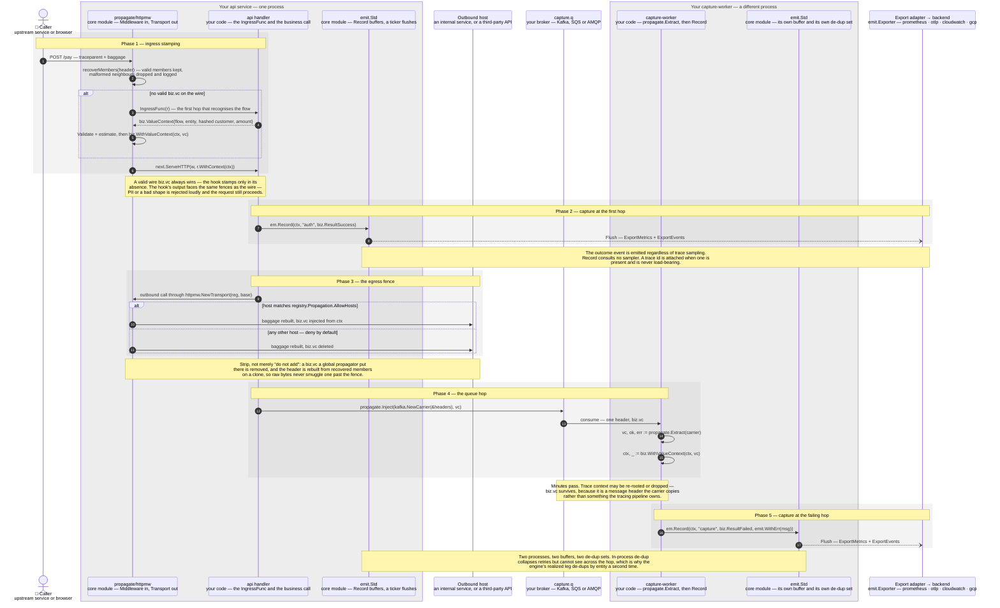

# Sequence — record and propagate across the queue

The direct fix for "correlation_id sometimes isn't there": value context is a
first-class propagated thing, **one** Baggage member, re-attached by the
consumer with one header copy and no per-team instrumentation ask. Drawn to
[the stencil](STYLE.md) — a sequence keeps the label grammar and the tables
and skips the palette ([§5](STYLE.md#5--sequences-the-same-grammar-a-different-renderer)).

Five phases, and two of them are fences rather than steps: the **ingress
stamp**, which is where a request that arrived without value context gets it,
and the **egress fence**, which is where a request heading somewhere it should
not carry money loses it again.

| # | Step | Mechanism / constraint |
|---|---|---|
| 1 | caller → `httpmw` | Ordinary inbound HTTP. `httpmw.Middleware(reg, WithIngress(f))` wraps your handler; nothing about the caller changes |
| 2 | `httpmw` → itself | `recoverMembers` parses the `baggage` header member by member and keeps the valid ones on `context.Context` as a `baggage.Baggage`. A malformed neighbour is dropped and logged, never fatal — and never hides a valid `biz.vc`. **The decode to a `ValueContext` is lazy**: it happens in `biz.FromContext`, at read time |
| 3 | `httpmw` → api handler | The ingress hook, `IngressFunc func(*http.Request) (biz.ValueContext, bool)` — your code, because only your code knows which route is which flow. Called **only** when the wire carried no valid `biz.vc` |
| 4 | api handler → `httpmw` | The stamp: flow, entity id, hashed customer id, amount, currency, kind, segment, deadline. A hook that cannot know the amount returns `Estimated: true` with a zero amount, and the registry's entry-point estimator fills it |
| 5 | `httpmw` → itself | `vc.Validate()` first (the PII guard, `biz.CheckPII`, lives here — **not** in the codec), then `biz.WithValueContext(ctx, vc)`, which encodes to the single `biz.vc` member. Encode fails loudly on an out-of-domain deadline or past **512 UTF-8 bytes** (`*biz.OversizeError`); either way the request proceeds without a stamp rather than 500ing |
| 6 | `httpmw` → api handler | `next.ServeHTTP` with the enriched `ctx`. From here `biz.FromContext` works everywhere downstream, which is the whole point of the middleware |
| 7 | api handler → `emit` | `Record(ctx, stage string, result biz.Result, opts ...Option)` — the `ValueContext` is read off the `ctx`, never passed as an argument. It buffers and returns; it never blocks the business request and never returns an error. Two metric points normally (`biz_txn_total` always, `biz_value_total` unless `vc.Estimated`) plus one `biz.Outcome` |
| 8 | `emit` ⇢ export adapter | **Asynchronous.** `Record` does not reach the exporter; a background ticker (1 s by default) and `Close` call `Flush`, which calls `ExportMetrics` and `ExportEvents`. A drop at any point increments `biz_dropped_events_total{reason}` — `invalid`, `overflow` or `export` |
| 9 | api handler → `httpmw` | `httpmw.NewTransport(reg, base)` is an `http.RoundTripper`, so the fence applies to every outbound call your client makes, including **each redirect hop** — a redirect from an allowed host to a disallowed one is fenced at the second hop |
| 10 | `httpmw` → outbound host | Allowed: `biz.EncodeVC(vc)` from the request's own `ctx` replaces any stale member. The allowlist is `registry.Propagation.AllowHosts`, matched exactly or as `*.domain` against a strictly deeper subdomain; an empty allowlist denies everything |
| 11 | `httpmw` → outbound host | Not allowed: `delete(members, biz.MemberKey)`. Foreign members still pass through, and if a safe header cannot be rebuilt the `baggage` header is dropped entirely — fail closed |
| 12 | api handler → broker | `propagate.Inject(carrier, vc)` writes exactly one header, key `biz.vc`, the same key the HTTP `baggage` header uses. `propagate/kafka`, `sqs` and `amqp` expose only `Get`/`Set`/`Keys` carriers and import no queue client library, so your broker client stays yours |
| 13 | broker → worker | One header copied across the hop. The encoded form is versioned — a leading `1` and eleven pipe-delimited fields — so a decoder can evolve without breaking an old producer |
| 14 | worker → itself | `propagate.Extract` returns **three** distinguishable outcomes: `(vc, true, nil)` present and well-formed, `(_, false, nil)` absent, `(_, false, err)` present but corrupt. Corrupt is never silently read as absent. The library counts none of these — the error is handed back for your consumer to count |
| 15 | worker → itself | `biz.WithValueContext` re-attaches the decoded context, and the consumer is now indistinguishable from the producer as far as `Record` is concerned |
| 16 | worker → `emit` | `emit.WithErr` takes a **string**, not an `error`. The in-process de-dup key is `(flow, entity, stage, result)` — result is in the key, so a later `failed → success` transition on the same entity still emits |
| 17 | `emit` ⇢ export adapter | The worker's emitter is a different instance with its own buffer, its own de-dup set and its own flush ticker |

## Key facts this diagram encodes

- **The outcome event does not depend on a sampler.** `Record` reads no
  sampling decision; it attaches a trace id when the context has one and
  proceeds identically when it does not. Money accounting that dropped
  with the trace sample rate would under-report exactly during the traffic
  spike an incident produces.
- **The egress fence strips; it does not merely decline to add.** Toward a
  host outside `registry.Propagation.AllowHosts`, `Transport.RoundTrip`
  deletes an existing `biz.vc` member — including one a globally installed
  OTel Baggage propagator added — and rebuilds the whole header from
  recovered members onto a request clone, so the original raw bytes never
  reach the wire. Deny by default (ADR-0003): shipping a transaction amount
  and a customer id to a third party is a decision someone makes on purpose.
- **The PII guard is not in the codec, deliberately.** `EncodeVC` returns
  exactly what it was given; its only errors are an out-of-domain deadline
  and the 512-byte cap. `ValueContext.Validate` and `Outcome.Validate` are
  where PII and shape are judged — transport fidelity and semantic validity
  are separate judgments, and merging them would make a decoder's job
  depend on a policy that can change.
- **`Record` buffers; `Flush` exports.** The arrow from `emit` to the
  exporter is dashed and asynchronous for a reason: `Record` never blocks
  the business request and never returns an error, so every failure mode it
  has — invalid, overflow, export — is visible only as
  `biz_dropped_events_total{reason}`. That counter is the contract; there
  is no silent drop.
- **A corrupt header is distinguishable from a missing one — and the
  library counts neither.** `propagate.Extract` and `biz.FromContext` both
  return a three-way `(vc, ok, err)` precisely so a consumer can tell them
  apart, but nothing in `propagate/` increments a metric. Wiring the error
  to a counter is the consumer's job, and a consumer that ignores it will
  see the loss only as a coverage-ratio gap at reconciliation.
- **One member, not eight.** The whole `ValueContext` is a single versioned
  `biz.vc` Baggage member, which is what makes "the carrier copies one
  header" true across Kafka, SQS and AMQP alike. Eight members would be
  eight chances to copy seven, and the one dropped at the failing hop is the
  one that mattered.
- **In-process de-dup cannot span the queue hop.** The api service and the
  worker keep separate de-dup sets, so the same entity can legitimately
  produce outcomes from both. Cross-process de-dup is the engine's job, on
  the event side, by entity — see
  [the impact sequence](seq-impact-query.md).
