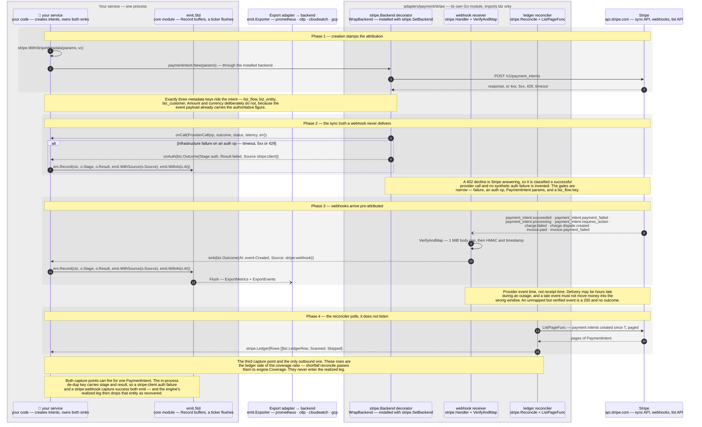

# Sequence — Stripe events become outcomes

Same signals, different capture point: metadata stamped at creation makes
every webhook arrive pre-attributed, and the wrapped backend sees the
infrastructure failures webhooks never report. Drawn to
[the stencil](STYLE.md); a sequence keeps the label grammar and the tables
and skips the palette
([§5](STYLE.md#5--sequences-the-same-grammar-a-different-renderer)).

`adapters/payment/stripe` is its own Go module and imports **`biz` only** —
not `emit`, not `engine`, not `registry`. It never calls `Record` and never
holds an `Exporter`. It produces `biz.Outcome` values and hands them to
callbacks **your** code registers; your code is what calls `emit`. That seam
is the reason a non-Stripe user never compiles stripe-go, and it is the thing
this diagram exists to draw correctly.

| # | Step | Mechanism / constraint |
|---|---|---|
| 1 | your service → itself | `WithStripeMetadata(p MetadataSetter, vc biz.ValueContext)` — a void mutator, not a wrapper. It takes anything with `AddMetadata(key, value string)`, so `*stripe.Params` and every params type embedding it qualifies. Keys: `biz_flow`, `biz_entity`, `biz_customer` |
| 2 | your service → backend decorator | Your call site is **unchanged stripe-go**. `WrapBackend` returns a `stripe.Backend` that embeds the inner one and overrides `Call`; you install it once with `stripe.SetBackend`. It creates nothing, reads no response body, and is invisible at the call site |
| 3 | backend decorator → Stripe | The inner backend's `Call`, timed. `deriveOp` turns method and path into an op like `payment_intents.create` |
| 4 | Stripe → backend decorator | `providerOutcome` classifies: status 0 (transport error or timeout), any 5xx, and 429 are `failed`. Every other 4xx is `success` — Stripe answered, and a declined card is a business result, not an outage |
| 5 | backend decorator → your service | `WithProviderMetric` callback. **It is a callback, not a counter**: `emit` has no API for `biz_provider_calls_total{provider, op, outcome}`, so wiring the `ProviderCall` to that metric is your code's job |
| 6 | backend decorator → your service | `WithAuthOutcome` callback, behind four gates: the call failed, the op is `payment_intents.create` or `.confirm`, the params are `*stripe.PaymentIntentParams`, and `biz_flow` metadata is present. The `ValueContext` is rebuilt from the **request params**, not the response, and `At` is the call-start time |
| 7 | your service → `emit` | Your sink. The adapter never reaches `emit` — `Source` is `stripe:client` here, which is what distinguishes this capture point from the webhook one downstream |
| 8 | Stripe → webhook receiver | Eight mapped event types, and the mapping is the adapter's whole opinion: succeeded/payment_failed/processing → `capture`, requires_action → `auth` deferred, `charge.failed` → `capture` failed, dispute → `dispute` failed, and the two `invoice.*` events → `settle`. A verified event outside the map is ignored with a 200 |
| 9 | webhook receiver → itself | Body capped at 1 MiB **before** verification, then `webhook.ConstructEventWithOptions` with `IgnoreAPIVersionMismatch`. The HMAC and timestamp checks still run — only the SDK's `api_version` pin is skipped, because the adapter reads stable primitive fields. A read or signature failure is a 400, which is what makes Stripe retry |
| 10 | webhook receiver → your service | `Handler(secret string, sink func(biz.Outcome))`. The outcome's `At` is `event.Created`, its `Source` is the constant `stripe:webhook`, and its `ValueContext` is reassembled from the metadata plus the payload's amount and currency. There is **no idempotency on `event.ID`** here — Stripe's redelivery is handled downstream |
| 11 | your service → `emit` | The documented sink: `biz.WithValueContext(ctx, o.VC)`, then `Record` with `emit.WithSource` and `emit.WithAt`. Those two options belong to `emit`, not to the adapter — the adapter sets the struct fields directly |
| 12 | `emit` ⇢ export adapter | Asynchronous, as everywhere: `Record` buffers, the ticker flushes, a drop increments `biz_dropped_events_total{reason}` |
| 13 | reconciler → Stripe | `Reconcile(ctx, fetch PageFunc, since time.Time)` pages through a caller-supplied `PageFunc`; `ListPageFunc` binds it to `paymentintent.Client`. The loop terminates on `!HasMore`, an empty page, or a cursor that stops advancing |
| 14 | Stripe → reconciler | Terminal statuses only are classified. The amount basis is the intent's `amount` — never `amount_received` (ADR-0010) — so a partial capture does not silently reduce the ledger side |
| 15 | reconciler → your service | `stripe.Ledger` is the adapter's own type wrapping `Rows []biz.LedgerRow` plus `Scanned` and `Skipped`. There is no `biz.Ledger`. `shortfall reconcile --ledger` hands the rows to `engine.Coverage` |

## Key facts this diagram encodes

- **The adapter emits nothing.** It imports `biz` and stripe-go and nothing
  else in this repo — no `emit`, no `Exporter`, no `Record`. Both capture
  points produce a `biz.Outcome` and hand it to a callback you registered,
  and your code decides what to do with it. Drawing an arrow from the
  adapter to an exporter would assert an import that does not exist and
  would quietly contradict the nested-module promise the adapter is built
  to keep.
- **Two capture points, two sources, and the double-count is caught
  downstream.** A create that times out emits `auth`/`failed` with
  `Source: stripe:client`; if Stripe processed it anyway, the webhook later
  emits `capture`/`success` with `Source: stripe:webhook`. The in-process
  de-dup key includes stage and result, so both emit — and the engine's
  realized leg then finds a success for that entity and drops it entirely.
  Net realized loss: zero, which is correct. On a metrics-only backend
  there is no entity to de-duplicate by, which is exactly what the realized
  leg's `metrics-only: upper bound` caveat is admitting to.
- **Infrastructure failure is auth truth. A decline is not.** Timeouts, 5xx
  and 429 are classified as failed provider calls, because Stripe never
  sends a webhook for a request it did not answer — that outcome exists
  nowhere else. Every other 4xx, a 402 card decline included, is Stripe
  answering, and inventing a synthetic auth failure for it would double-count
  against the webhook that follows.
- **Provider event time, not receipt time.** `At` comes from
  `event.Created`. During an outage a webhook can arrive hours late, and
  stamping it with receipt time would move realized loss into the wrong
  window — the one thing that makes a post-incident number
  unreconcilable.
- **Verification is not optional and not partial.** The body is capped
  before it is verified, the HMAC and timestamp checks always run, and an
  unverified payload is a 400 with no outcome delivered.
  `IgnoreAPIVersionMismatch` relaxes the SDK's version pin, not the
  signature.
- **The reconciler is the third capture point, and the only one that
  polls.** Webhooks and the wrapped backend are inbound and event-driven;
  `Reconcile` calls Stripe's list API on a schedule and produces
  `biz.LedgerRow`s for the coverage ratio. They are the *check* on the
  telemetry, never an input to it — a disagreement is a finding, not
  something to smooth over.
- **A Stripe outage shows up as a shortfall in your own entry-stage
  counter, not as webhook silence.** The counterfactual leg compares
  `biz_txn_total` at the flow's entry stage against the hour-of-week
  baseline — a stage **your** service records, upstream of any provider
  event. What this adapter contributes to that story is positive evidence,
  not absence: a non-zero `biz_provider_calls_total{outcome=failed}` in the
  window makes the engine append an upstream-attribution hint.
